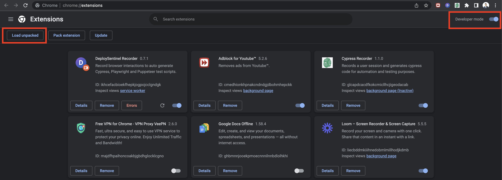

# Development Instructions

Install Dependencies: `yarn` (or `yarn --frozen-lockfile`)

## Chrome

Start Local Webpack Dev Server for Chrome: `yarn run start-chrome`

Compressed Chrome Extension: `yarn run build-chrome`

Run E2E Tests: `yarn test`

## Firefox

Start Local Webpack Dev Server for Firefox: `yarn run start-ff`

Compressed Firefox Extension: `yarn run build-ff`

Bundle source files for review: `yarn run bundle-source`

## How to setup

1. Run build command

```
yarn runn build-chrome
```

2. Then open Chrome extension and enable `Developer mode` then select folder
   `build` we just build in step 1



3. After installed, we can run `yarn run start-chrome`, and start on local
   development.
